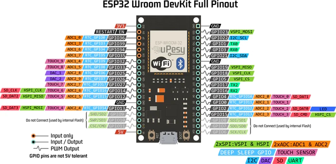
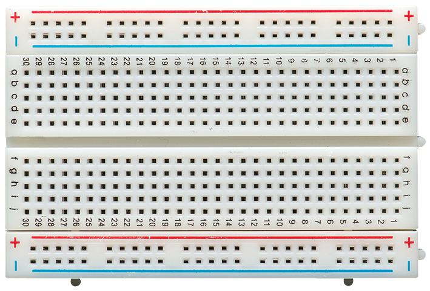
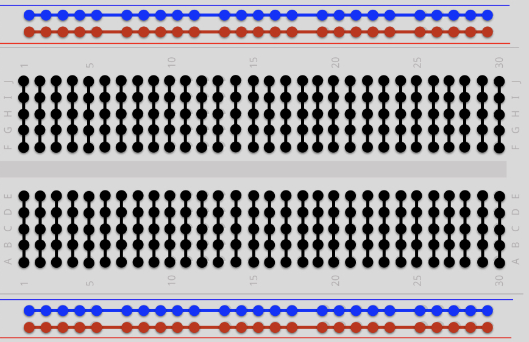
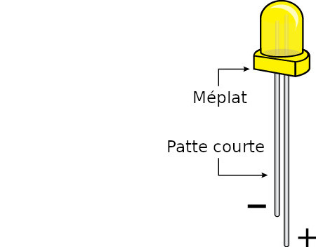
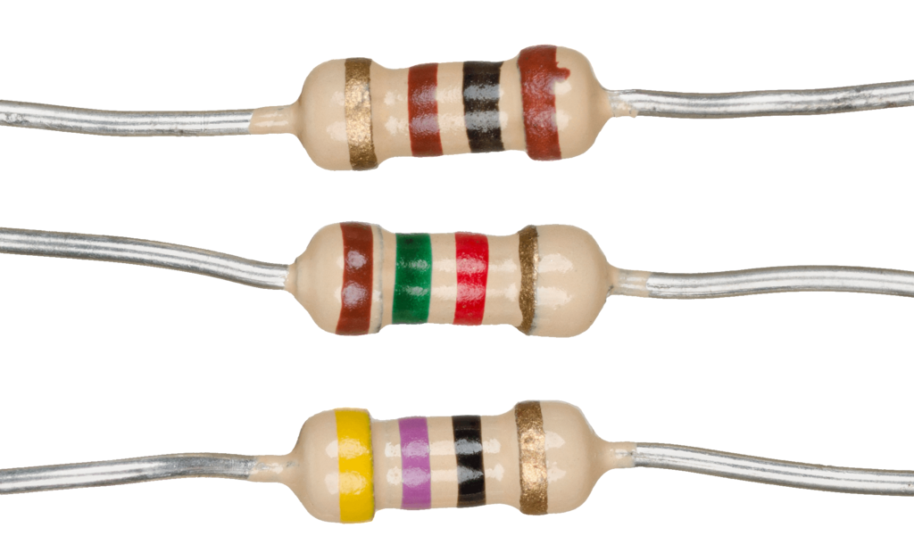

# 🔎 Identification et caractéristiques de chaque composant

## Micro-contrôleur

Le micro-contrôleur utilisé est un ESP32-WROOM-32 de type Dev Kit Module mini qui intègre sur la même circuit imprimé :
  - Processeur ESP32 : 32-bit CPU @ 240 MHz dual-core
  - Flash Size 4: MB
  - Wi-Fi : IEEE 802.11 b/g/n



## Breadboard

Une _breadboard_ ou plaque d'essai permet de brancher des composants électroniques entre eux sans les souder. Très utile pour prototyper.

Photos :


La connection entre les différents trous est par colonne et par ligne. Sur le diagramme ci-dessous, les lignes noires représentent les connections inter-trous.



Explications : [magpi.raspberrypi.com](https://magpi.raspberrypi.com/articles/breadboard-tutorial){:target="_blank"}, [learn.adafruit.com](https://learn.adafruit.com/breadboards-for-beginners){:target="_blank"}

## LED



Patte la plus longue = Anode (+) / Patte la plus courte = Cathode (-)

Le méplat est toujours du côté Cathode (-)

Explications : [circuits-diy](https://www.circuits-diy.com/how-to-blink-led-using-an-arduino/){:target="_blank"}

## Micro switch

TODO


## Résistance

Norme du code des couleurs : [CEI_60757](https://fr.wikipedia.org/wiki/CEI_60757){:target="_blank"}

Mnémonic pour se rappeler des couleurs :
```
Ne Manger Rien Ou Jeûner, Voilà Bien Votre Grande Bêtise
⚫   🟤    🔴  🟠   🟡     🟣    🔵    🟢   🔘     ⚪
0    1     2  3    4     5     6     7    8     9
```

Voir [ce site pour le calcul des valeurs de résistances](https://www.electronique-radioamateur.fr/elec/composants/resistance-code-couleurs.php){:target="_blank"}.



## Afficheur LCD i2c

TODO


----
Sources : [microcontrollerslab](https://microcontrollerslab.com){:target="_blank"}, [element14](https://element14.com){:target="_blank"}, [raspberrypi](https://magpi.raspberrypi.com){:target="_blank"}, [circuits-diy](https://www.circuits-diy.com){:target="_blank"}
